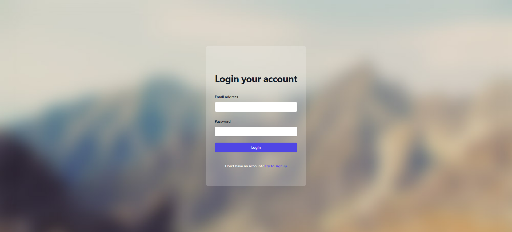
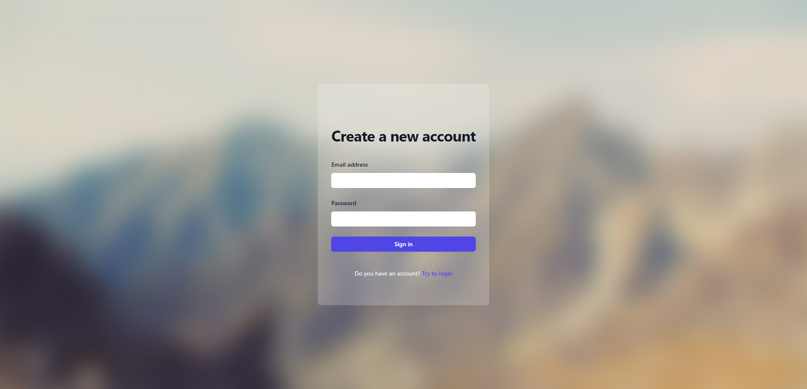
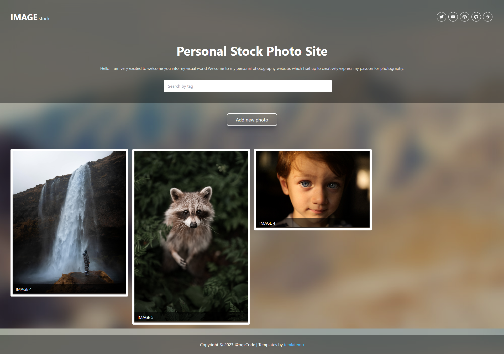

# Full Stack Image Stock App
MERN Stack kullanarak geliştirdiğim resim depolama uygulaması.

## Öğrendiklerim ve Uyguladıklarım
* Node/Express.js ile backend programlama
* MongoDB ile veritabanı işlemleri
* JWT token ile kullanıcı doğrulama işlemlerini yönetme.
* react-router ile korumalı sayfaları yönetme
* JWT token ın istemci tarafında saklanması ve yönetilmesi.
* multer ile resim dosyası yükleme ve yönetme.

### Kullandığım Teknolojiler
* Node.js/express.js
* MongoDB
* React.js
* Vite.js
* Tailwind.css

#### Kurulum ve Kullanım
> Cihazınızda MongoDB ve Node.js kurulu olmalıdır.
```
git clone https://github.com/ogzcode/Full-Stack-Image-Stock-App.git

cd server
npm i
npm start

cd client
npm i
npm run dev
```

#### Ekran Görüntüleri
Login


Register


Home

